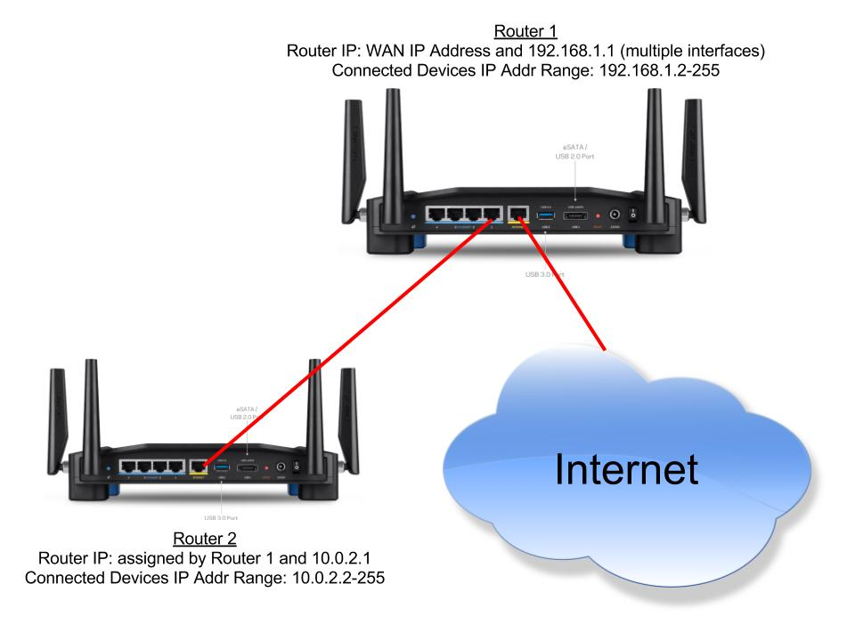
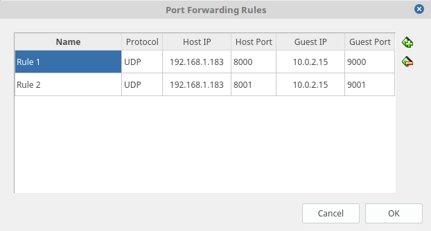

# **EE 250L Spring 2018 Lab 04 Part 2**

In part 2, we will switch over to the UDP protocol and communicate between your
VM and your Raspberry Pi over the Wireless Local Area Network (WLAN) using
sockets. Every machine/device typically has a single IP address. To send packets 
to a specific process on a machine, you would have to use ports at the transport
layer (or L4). The example we will run here will illustrate how this works.

## Step 1:

Read through the scripts in the directory. Open up two terminals in your VM and 
run both of the server scripts without modification, each in a different 
terminal:

    python3 udpServer1.py
    python3 udpServer2.py

**Question 1**: What happens when you try to run both server scripts? Copy-paste the 
output into your lab answer sheet.

## Step 2:

Stop any running instances of the server scripts by clicking anywhere inside the
terminal window to bring it into focus and pressing `Ctrl+c`. This sends the 
SIGINT signal to the process to tell it to stop.

Edit the two server scripts to listen in on two different ports in the 9000s 
range. This is an uncommon range of ports, so they should all be free. Run both 
server scripts. 

**Question 2**: Open a third terminal and run the client script 
(`python3 udpClient.py`). Make sure not to run with sudo rights. What happens? 
Copy-paste teh output into your lab answer sheet. Then, change the `port` 
variable to 1024, and run the script. What happens? Google around to explain 
what is going on.

Stop the instance of `udpClient.py` using `Ctrl+c`. Change `port` in the client
script to 5001 and run the client script. Use the client script to send messages
to the two different UDP servers you insantiated by inputting the port numbers 
you set for the UDP server scripts.

## Step 3:

Now, we'll run the code on two separate machines (your VM and rpi). Don't worry 
about pushing any of your changes. We'll do this manually using a text editor
on your rpi. Login to your rpi and clone this repository under the directory you 
have been using for the RIOT-EE250 labs. Remember, this step is important 
because the rpis may be used by someone else!

In this step, we want to send packets from your rpi to your VMs over the local area network 
to our rpi. To do this, we need the VM to listen (or bind) to its LAN IP. In 
the SSH session with your rpi, type `ifconfig`. In the output, find the rpi's
LAN IPv4 address and write it down somewhere. Open a terminal in your VM and 
run `ifconfig`. Find the LAN IPv4 address of your VM. Take a look at mentally
note the differences of the two IP addresses.

**Question 3**: In your answer sheet, list out the IPv4 address of your VM and
rpi. 

Understand:

The default networking mode of VirtualBox is to enable something called a 
Network Address Translator (NAT). This is how the routers you use at home work.
Most commercial routers allocate private Local Area Network IP addresses to 
connected devices that look something like `192.168.1.100`. This is how our
our class router behaves. Since these are internal IP addresses,
you would not be able to connect to any device behind a router network from the
Internet by using these address. Instead, you would need to use the Wide Area
Network (WAN) address (aka the static or dynamic IP allocated by your Internet
Service Provider (ISP)). However, this is not straight forward because trying 
to connect to a WAN address will actually lead to connecting to just the router.
To address a specific device behind a router, you would need to setup something 
called **port forwarding** in a router's firmware.

Since VirtualBox also creates another NAT, you may see that your VM's IP address
looks something like `10.0.2.15`. As an *analogy*, this behavior is similar to 
plugging a router into another router like in the figure below.

{:height="36px" width="36px"}

In this picture, there is a double NAT. Devices connected to Router 1 will not
be able to connect to devices connected to Router 2 without setting up 
**port forwarding**. However, devices connected to Router 2 will 
still be able connect to devices connected to Router 1 because of the typical 
default router settings out of the box. Going back to our situation of 
VirtualBox running a NAT, we need to setup port forwarding so your RPi can 
connect to your VM.

VirtualBox Port Forwarding:

Find the VirtualBox network settings and add two port forwarding rules, one for
each UDP server script. You should not have to shutdown or restart your VM, but
this may help you debug any issues. Below is an example set of the rules for the
following setup:

 * Host OS IP: 192.168.1.183
 * VM IP: 10.0.2.15
 * udpServer1.py port: 9000
 * udpServer2.py port: 9001

 

Note the use of port 8000 and 8001 under the Host Port column. Please use these
two ports for your rules. Once you have your port forwarding rules set, 
you can try to run all three scripts. On your VM, set the `host` variable in 
both server scripts to the IPv4 address of your VM (e.g. 10.0.2.15 for the 
example setup above). Also, change
the port numbers to be the two different numbers in the 9000s range you used in
your port forwarding rules. Once you are finished, run both server scripts in
separate terminals. In the terminal with the SSH session to your rpi, 
change the `host` variable in `udpClient.py` to your rpi's IP address and change
the `server` variable to your host OS's IP address (NOT your VM's IP Address). 
Run `python3 udpClient.py` and try to send a message to the two processes 
running on your VM by using **ports 8000 and 8001**. If you are successful, move
on to part 3.
